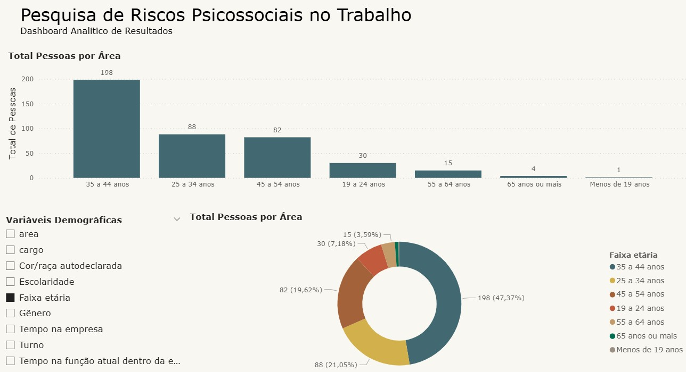

# PROART: Análise de Pesquisa Organizacional



Processamento, limpeza e estruturação de dados de uma pesquisa de clima organizacional (escala PROART). Transforma dados brutos em dataset preparado para Power BI.

**473 respostas** (418 completas) | **19 variáveis** | **7 áreas** | **89 questões** em **9 fatores**

## Metodologia

1. Importacao dos dados brutos (Excel) com Pandas
2. Transformacao de variaveis numericas em categoricas
3. Limpeza: remocao de duplicatas, tratamento de nulos, coluna 100% vazia excluida
4. Filtragem: apenas respostas completas (418 registros)
5. Criacao de colunas derivadas (Area e Cargo)
6. Mapeamento das 89 questoes aos 9 fatores PROART

## Estrutura

```
analise-pesquisa-organizacional/
├── analise.ipynb
├── requirements.txt
├── data/dadosbrutos.xlsx
├── output/dados-tratados.xlsx
├── assets/dashboard.jpg
└── powerbi.att.pbix
```

## Ambiente

Abra o terminal na pasta do projeto e execute:


**Windows**
```bash
python -m venv .venv
.venv\Scripts\activate
pip install -r requirements.txt
```

**Linux / macOS**
```bash
python3 -m venv .venv
source .venv/bin/activate
pip install -r requirements.txt
```

## Execucao

```bash
jupyter notebook analise.ipynb
```

## Resultados

- **88,4%** de completude
- **418 respondentes** validos
- **9 fatores** organizacionais mapeados
- **7 areas** e **19 cargos** representados
